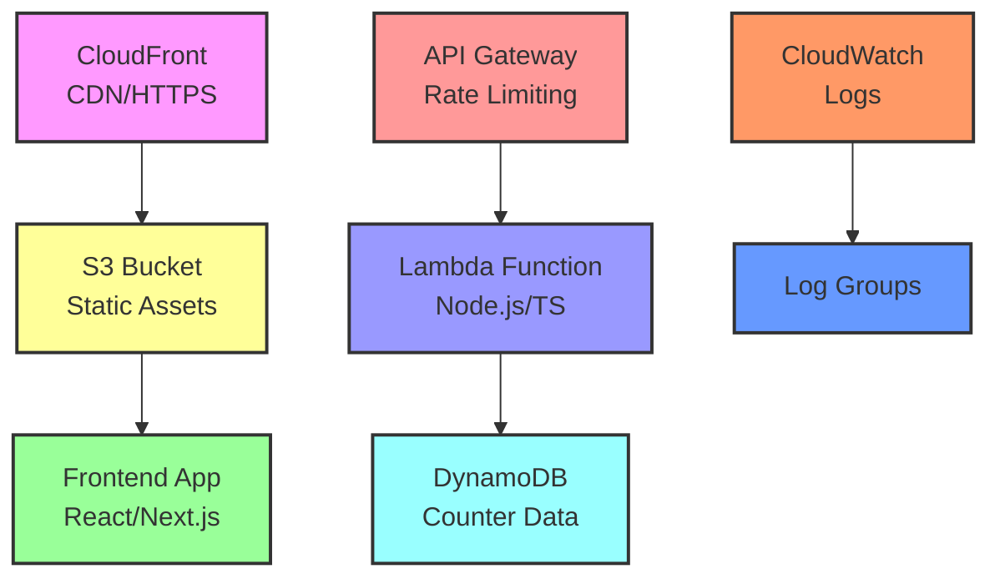
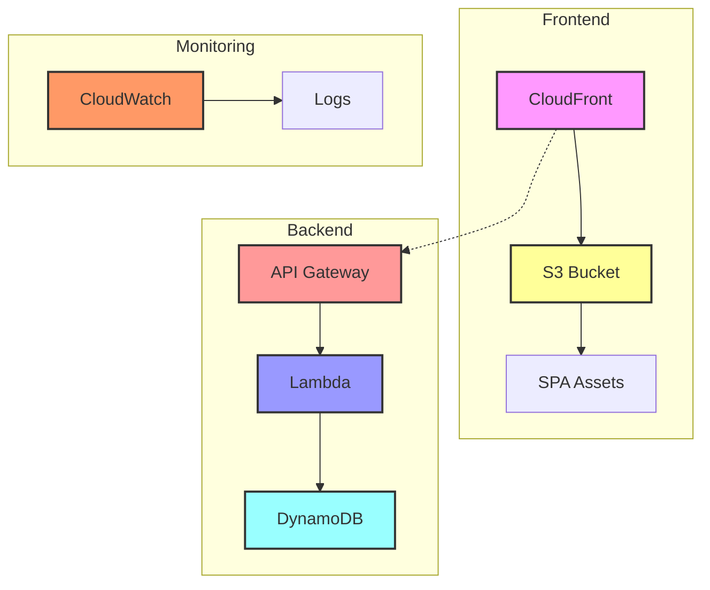
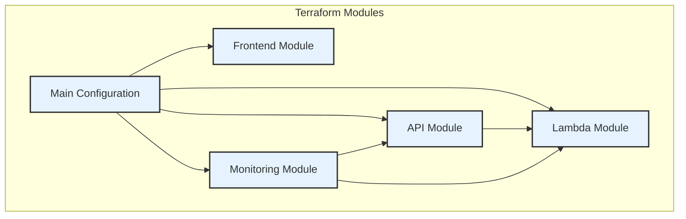

# Infrastructure

This directory contains the Terraform infrastructure-as-code for the Number Acidizer project.

## Overview

The infrastructure consists of several AWS services deployed in a modular architecture:

- **Lambda Function**: Serverless backend handling counter operations
- **API Gateway**: REST API with rate limiting and throttling
- **S3 + CloudFront**: Static website hosting with CDN
- **DynamoDB**: NoSQL database for counter storage (referenced, not created)
- **CloudWatch**: Basic logging for Lambda and API Gateway

## Architecture

### High-Level Overview



### Detailed Component Interaction



## Project Structure

### Module Dependencies



### Directory Structure

```
infrastructure/
├── modules/
│   ├── api/          # API Gateway configuration
│   │   ├── main.tf
│   │   ├── variables.tf
│   │   └── outputs.tf
│   ├── lambda/       # Lambda function setup
│   │   ├── main.tf
│   │   ├── variables.tf
│   │   └── outputs.tf
│   ├── frontend/     # S3 and CloudFront
│   │   ├── main.tf
│   │   ├── variables.tf
│   │   └── outputs.tf
│   └── monitoring/   # CloudWatch logging
│       ├── main.tf
│       ├── variables.tf
│       └── outputs.tf
├── main.tf          # Main configuration using modules
├── variables.tf     # Input variables
├── outputs.tf       # Output values
└── README.md        # This file
```

## Prerequisites

1. **AWS CLI** configured with appropriate credentials
2. **Terraform** >= 1.0 installed
3. **Node.js** >= 14 (for Lambda function)
4. **ECR Repository** with Lambda container image
5. **DynamoDB Table** and **IAM Role** (created separately)

## Configuration

### Environment Variables

The following variables can be configured:

| Variable | Description | Default | Required |
|----------|-------------|---------|----------|
| `lambda_image_uri` | ECR URI for Lambda container | - | Yes |
| `environment` | Environment name (dev/staging/prod) | `dev` | No |
| `api_rate_limit` | API requests per second | `10` | No |
| `api_burst_limit` | API burst capacity | `20` | No |
| `lambda_timeout` | Lambda timeout in seconds | `30` | No |
| `lambda_memory_size` | Lambda memory in MB | `256` | No |
| `cloudwatch_log_retention_days` | Log retention period | `14` | No |

### Example terraform.tfvars

```hcl
lambda_image_uri = "123456789012.dkr.ecr.us-east-1.amazonaws.com/acidizer-dev-backend:latest"
environment = "dev"
api_rate_limit = 10
api_burst_limit = 20
lambda_timeout = 30
lambda_memory_size = 256
cloudwatch_log_retention_days = 14
```

## Usage

### 1. Initialize Terraform

```bash
cd infrastructure
terraform init
```

### 2. Plan Deployment

```bash
terraform plan -var="lambda_image_uri=YOUR_ECR_URI"
```

### 3. Apply Changes

```bash
terraform apply -var="lambda_image_uri=YOUR_ECR_URI"
```

### 4. Destroy Resources (when needed)

```bash
terraform destroy -var="lambda_image_uri=YOUR_ECR_URI"
```

## Outputs

After successful deployment, Terraform will output:

- `api_url`: Backend API endpoint URL
- `frontend_url`: CloudFront distribution URL
- `frontend_bucket`: S3 bucket name for uploads
- `api_key`: API key for rate limiting (sensitive)
- `lambda_function_name`: Lambda function name

## Monitoring

The infrastructure includes basic logging:

### Log Groups

- API Gateway logs: `/aws/apigateway/acidizer-{env}`
- Lambda logs: `/aws/lambda/acidizer-{env}-backend`

## Security Features

### S3 Security
- Server-side encryption enabled (AES256)
- Versioning enabled for file recovery
- Public access controlled via bucket policy

### API Gateway Security
- Rate limiting (10 req/sec by default)
- Request validation enabled
- CORS properly configured
- HTTPS only (CloudFront redirect)

### Lambda Security
- Minimal IAM permissions
- Environment variable encryption

## Cost Optimization

- CloudWatch log retention: 14 days (configurable)
- Lambda: Pay-per-request pricing
- S3: Standard storage class
- CloudFront: Default price class
- API Gateway: No reserved capacity

## Scaling Considerations

The infrastructure auto-scales based on:
- **Lambda**: Concurrent execution scaling
- **API Gateway**: Built-in auto-scaling
- **CloudFront**: Global edge locations
- **DynamoDB**: On-demand billing mode

## Troubleshooting

### Common Issues

1. **Lambda Permission Errors**
   - Check IAM role permissions
   - Verify ECR image URI

2. **API Gateway 5XX Errors**
   - Check Lambda function logs
   - Verify DynamoDB table exists

3. **CloudFront Cache Issues**
   - Create invalidation for updated files
   - Check S3 bucket policy

### Useful Commands

```bash
# View Lambda logs
aws logs tail /aws/lambda/acidizer-dev-backend --follow

# Check API Gateway logs
aws logs tail /aws/apigateway/acidizer-dev --follow

# Create CloudFront invalidation
aws cloudfront create-invalidation --distribution-id YOUR_ID --paths "/*"
```

## Contributing

When making infrastructure changes:

1. Update variable descriptions in `variables.tf`
2. Add new outputs to `outputs.tf`
3. Update this README with new features
4. Test in development environment first
5. Follow Terraform best practices 